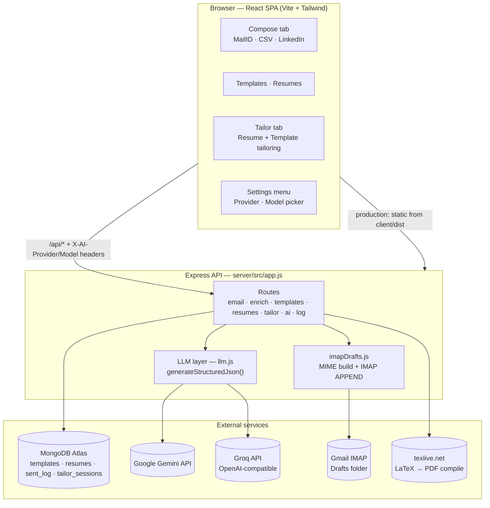
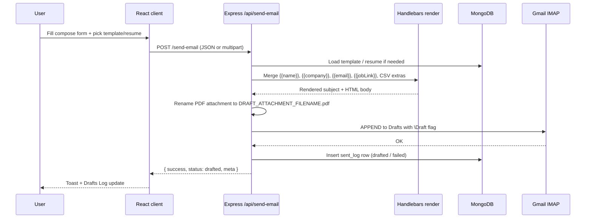
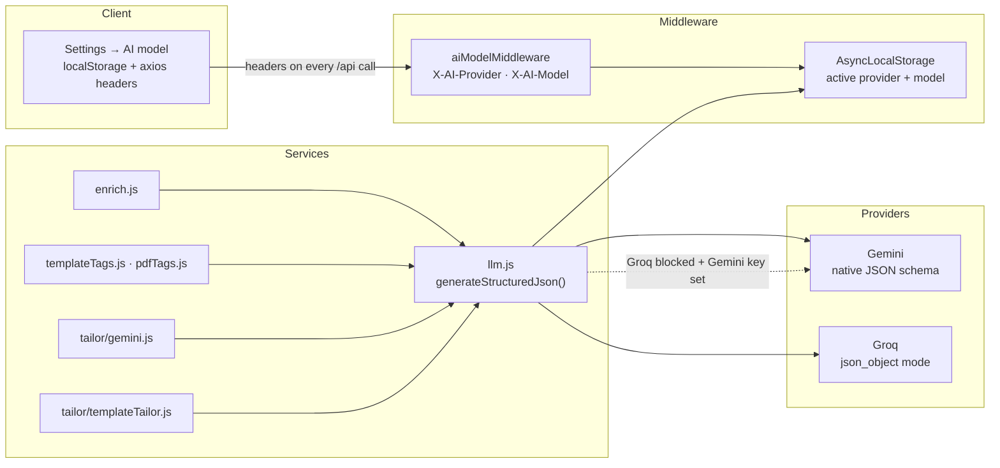
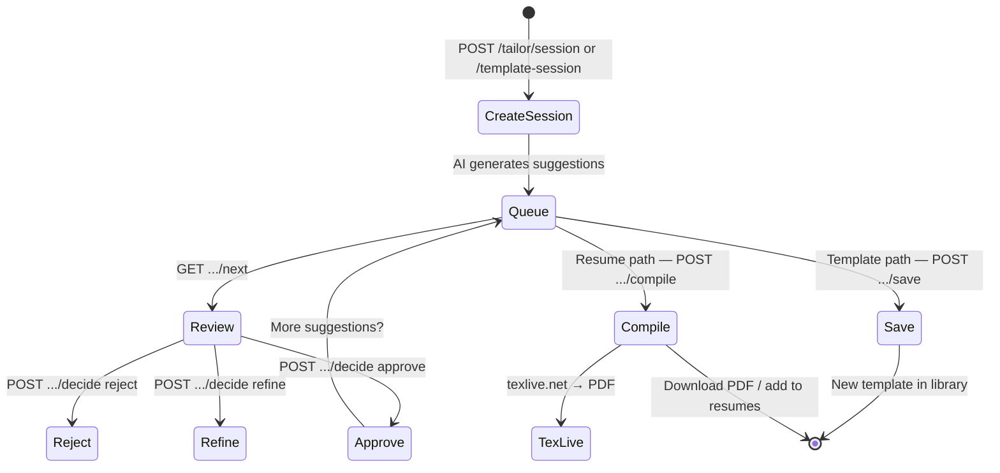

# coldMail — Project Details

Deep-dive documentation for architecture, data flows, AI integration, and deployment. For a quick overview and setup, see [README.md](./README.md).

## Contents

- [What this project is](#what-this-project-is)
- [High-level architecture](#high-level-architecture)
- [Request flow — saving a draft](#request-flow--saving-a-draft)
- [AI architecture](#ai-architecture)
- [Tailor system](#tailor-system)
- [Why drafts instead of direct send?](#why-drafts-instead-of-direct-send)
- [Module map](#module-map)
- [MongoDB collections](#mongodb-collections)
- [Compose modes](#compose-modes)
- [Library](#library)
- [Configuration reference](#configuration-reference)
- [API reference](#api-reference)
- [Deployment (Render)](#deployment-render)
- [Security](#security)
- [Development](#development)

---

## What this project is

**coldMail** is a personal cold-email workbench. You maintain a library of HTML templates and PDF resumes, compose personalised outreach in three input modes, optionally let AI pick the best template/resume for a job description, tailor content to a JD, and save every message as a **Gmail draft** (via IMAP) with a consistent resume attachment filename.

The app is a **React + Express monorepo** with **MongoDB Atlas** persistence. AI features run through a unified LLM layer that supports **Google Gemini** and **Groq**, selectable from the header settings menu.

---

## High-level architecture



**Single-origin in production:** Express serves the built SPA at `/` and the API at `/api/*` — one URL, one process, one Render deploy.

**Development:** Vite dev server (typically `:5173` or `:5174`) proxies `/api` to Express on `:4000`. CORS allows configured origins plus any `localhost` port in dev mode.

---

## Request flow — saving a draft



---

## AI architecture

All structured-AI calls go through one server abstraction:



| Component | Role |
|-----------|------|
| `server/src/services/aiModel.js` | Provider/model defaults, env parsing, model listing, Groq probe |
| `server/src/services/llm.js` | Single entry: `generateStructuredJson({ systemPrompt, userPrompt, schema, temperature, parts? })` |
| `server/src/services/aiErrors.js` | Maps quota, blocked-model, and provider errors to friendly HTTP messages |
| `server/src/middleware/aiModel.js` | Reads `X-AI-Provider` + `X-AI-Model` (legacy: `X-Gemini-Model`) per request |
| `client/src/lib/aiModel.js` | Persists provider/model in localStorage; attaches headers via axios interceptor |

### What each AI feature sends to the model

| Feature | Endpoint | Input to model | Output schema |
|---------|----------|----------------|---------------|
| Email patterns | `POST /api/enrich/email` | Company name + optional domain | 5 ranked `{pattern, confidence, reasoning}` |
| Name extraction | `POST /api/enrich/names` | Email list + company | `{candidates: [{email, name}]}` |
| JD match | `POST /api/enrich/jd-match` | JD + library `{id, name, tags}` only | `{templateId, resumeId, reasoning}` |
| Job intake | `POST /api/enrich/job-intake` | Pasted JD or fetched job URL text | `{jd, company, roleTitle}` |
| Template auto-tag | `POST /api/templates/suggest-tags` | Subject + plain body | `{tags: string[]}` |
| Resume auto-tag | `POST /api/resumes/suggest-tags` | PDF bytes (Gemini multimodal) | `{tags: string[]}` |
| Resume tailor | `POST /api/tailor/session` | Parsed LaTeX sections + JD | Ordered suggestion list |
| Template tailor | `POST /api/tailor/template-session` | Template paragraphs + JD | Ordered rewrite suggestions |

**Privacy:** JD matching and enrichment never send full template bodies or PDF bytes unless the specific feature requires it (e.g. PDF tagging, resume tailoring). JD match only sees `{id, name, tags}`.

**Groq notes:**
- Uses OpenAI-compatible chat completions with `response_format: { type: "json_object" }`.
- PDF analysis requires Gemini (Groq has no PDF input); the server auto-falls back when a Gemini key is set.
- If a Groq model is **blocked at project level**, the server auto-falls back to Gemini when configured.
- Enable models at [Groq project limits](https://console.groq.com/settings/project/limits).

---

## Tailor system

The **Tailor** tab supports two parallel workflows:



**Resume tailor**
- Parses a LaTeX CV into sections, bullets, and skills lines.
- AI suggests **content-only** rewrites (same macros, same structure).
- Approved edits compile via [texlive.net](https://texlive.net) to a PDF.
- Sessions persist in MongoDB with queue state.

**Template tailor**
- Parses email template into subject + HTML/plain paragraphs.
- AI suggests paragraph-level rewrites that preserve HTML structure and `{{handlebars}}` tokens.
- Approved result can be saved as a new template.

---

## Why drafts instead of direct send?

Render's free tier blocks outbound SMTP (ports 25/465/587). Options considered:

| Option | Outcome | Cost |
|--------|---------|------|
| Render Starter | SMTP unblocks | ~$7/mo |
| HTTPS email API (Resend, etc.) | Sends from shared/onboarding domain unless verified | Free with caveats |
| **IMAP `APPEND` to Gmail Drafts** | Review + native Gmail Schedule Send | Free |

The app uses **IMAP `APPEND`** with the `\Draft` flag so you review every message in Gmail. `RESEND_API_KEY` remains supported as an optional direct-send path for environments where SMTP/API send is available.

Whichever PDF the user picks is renamed server-side to `DRAFT_ATTACHMENT_FILENAME.pdf` (default: `Sk_Sahil_Parvez_CV.pdf`).

---

## Module map

```
coldMail/
├── client/                              # React 18 + Vite + Tailwind 3
│   └── src/
│       ├── App.jsx                      # Tabs: Compose / Templates / Resumes / Tailor / Drafts Log
│       ├── main.jsx                     # Theme class on <html> before React mounts
│       ├── lib/
│       │   ├── api.js                   # Axios client + API wrappers
│       │   ├── aiModel.js               # Provider/model localStorage + request headers
│       │   ├── tailorApi.js             # Tailor session API client
│       │   ├── render.js                # Client-side Handlebars preview
│       │   └── jdContext.jsx            # Shared JD state for compose + tailor
│       └── components/
│           ├── EmailForm.jsx            # Parent for three compose modes
│           ├── MailIDPanel.jsx          # By MailID (rose)
│           ├── CsvUploader.jsx          # By CSV (emerald)
│           ├── LinkedInPanel.jsx        # By LinkedIn (sky)
│           ├── EnrichPanel.jsx          # 5 email candidates + per-row Draft
│           ├── JDMatcher.jsx            # JD → template + resume picker
│           ├── TemplateLibrary.jsx      # CRUD + auto-tag + tailor entry
│           ├── ResumeLibrary.jsx        # PDF CRUD + auto-tag
│           ├── Tailor/                  # Resume + template tailoring UI
│           ├── GeminiModelPicker.jsx    # Provider/model picker (Gemini + Groq)
│           ├── HeaderSettingsMenu.jsx   # Status, theme, AI model
│           └── SentLog.jsx              # Drafts audit log
├── server/                              # Express 4 (ESM)
│   └── src/
│       ├── app.js                       # CORS, helmet, routes, SPA fallback
│       ├── index.js                     # Boot, Mongo connect, graceful shutdown
│       ├── routes/
│       │   ├── email.js                 # /preview · /send-email · /send-bulk
│       │   ├── templates.js             # CRUD + suggest-tags
│       │   ├── resumes.js               # CRUD, multipart PDF, suggest-tags
│       │   ├── enrich.js                # email · names · jd-match · job-intake
│       │   ├── tailor.js                # Resume + template tailor sessions
│       │   ├── ai.js                    # /models · /providers
│       │   └── log.js                   # Drafts log
│       ├── services/
│       │   ├── db.js                    # Mongo client + indexes
│       │   ├── store.js                 # Generic CRUD (templates, sent_log)
│       │   ├── resumeStore.js           # Binary-safe resume storage
│       │   ├── imapDrafts.js            # MIME build + IMAP APPEND
│       │   ├── enrich.js                # Enrichment + JD match + job intake
│       │   ├── llm.js                   # Unified Gemini/Groq structured JSON
│       │   ├── aiModel.js               # Provider/model config + listing
│       │   ├── templateTags.js          # AI template tagging
│       │   ├── pdfTags.js               # AI resume PDF tagging
│       │   ├── mailer.js                # Legacy SMTP / Resend path
│       │   └── tailor/                  # LaTeX parse, compile, session, AI suggestions
│       └── middleware/                  # validate · rateLimit · upload · aiModel · error
├── scripts/                             # CLI apply pipeline (optional automation)
├── render.yaml                          # Render Blueprint
└── package.json                         # Root: install:all · dev · build · start
```

---

## MongoDB collections

| Collection | Contents |
|------------|----------|
| `templates` | `{ id, name, subject, body, tags[], createdAt, updatedAt }` |
| `resumes` | `{ id, name, tags[], filename, contentType, content (Binary), size }` |
| `sent_log` | Draft send attempts: recipient, subject, status, timestamp, error |
| `tailor_sessions` | Resume tailor session state, suggestion queue, applied edits |

Indexes are ensured on boot via `server/src/services/db.js`.

---

## Compose modes

### By MailID (rose)

Paste emails (comma / space / newline). One company applies to all. **Extract names with AI** calls `POST /api/enrich/names`. On failure (quota, blocked Groq model, network), falls back to algorithmic local-part splitting.

### By CSV (emerald)

Upload CSV with `email,name,company,...`. Extra columns become `{{column}}` merge tokens.

### By LinkedIn (sky)

Paste a `linkedin.com/in/<slug>` URL. Name is parsed from the slug. **Find emails with AI** calls `POST /api/enrich/email` → 5 ranked patterns with MX validation.

### Job link

Optional URL field exposed as `{{jobLink}}` for the whole batch. Insert via the **Insert variable** dropdown in Subject/Body.

### Match by JD

Collapsible card above template/resume pickers. Sends JD + library metadata to `POST /api/enrich/jd-match`.

---

## Library

### Templates

Subject + HTML body + tags. Row actions: Preview, AI Tailor, Auto tag, Edit, Edit a copy, Delete. **Insert variable** dropdown for merge tokens.

### Resumes

PDF upload (≤10 MB), stored inline in MongoDB. Auto-tag reads PDF via Gemini multimodal (Groq falls back to Gemini for PDF).

### Tags

Normalised: lowercase, hyphenated, deduped, max 25 tags × 24 chars. OR-filter pill bar above compose pickers.

---

## Configuration reference

Full template: [`server/.env.example`](./server/.env.example).

```env
# Server
PORT=4000
NODE_ENV=development
CORS_ORIGIN=http://localhost:5173

# MongoDB Atlas (required)
MONGODB_URI=mongodb+srv://...
MONGODB_DB=coldmail

# Gmail — IMAP for drafts; SMTP for local dev fallback
SMTP_USER=you@gmail.com
SMTP_PASS=xxxx xxxx xxxx xxxx
IMAP_HOST=imap.gmail.com
IMAP_PORT=993
MAIL_FROM="Your Name <you@gmail.com>"
DRAFT_ATTACHMENT_FILENAME=Sk_Sahil_Parvez_CV

# AI — at least one key enables AI features
GEMINI_API_KEY=
GEMINI_MODEL=gemini-2.5-flash
GROQ_API_KEY=
GROQ_MODEL=llama-3.3-70b-versatile
AI_PROVIDER=gemini
ENRICH_CONFIDENCE_THRESHOLD=0.5

# Rate limits
RATE_LIMIT_WINDOW_MIN=1
RATE_LIMIT_MAX=30
BULK_SEND_DELAY_MS=250

# Tailor
CV_DEFAULT_PATH=./Sk_Sahil_Parvez_CV_
TEXLIVE_NET_URL=https://texlive.net/cgi-bin/latexcgi
```

### Gmail App Password

1. Enable 2-Step Verification.
2. Create an app password at <https://myaccount.google.com/apppasswords>.
3. Paste into `SMTP_PASS` — same credential is used for IMAP.

### AI keys

| Provider | Key URL | Default model |
|----------|---------|---------------|
| Gemini | <https://aistudio.google.com/app/apikey> | `gemini-2.5-flash` |
| Groq | <https://console.groq.com/keys> | `llama-3.3-70b-versatile` |

Pick provider + model in **Settings → AI model**. Choice is sent on every API request and stored in browser localStorage.

---

## API reference

All endpoints under `/api`. Rate-limited: send, enrich, tailor.

| Method | Path | Description |
|--------|------|-------------|
| GET | `/health` | Liveness, Mongo ping, `features.aiEnrich`, `features.aiProviders` |
| GET | `/ai/models?provider=gemini\|groq` | List models for provider |
| GET | `/ai/providers` | Which providers have keys configured |
| POST | `/preview` | Server-side Handlebars render |
| POST | `/send-email` | Save one Gmail draft |
| POST | `/send-bulk` | Save N drafts sequentially |
| POST | `/enrich/email` | 5 candidate address patterns |
| POST | `/enrich/names` | Infer name per email |
| POST | `/enrich/jd-match` | Pick template + resume for JD |
| POST | `/enrich/job-intake` | Extract JD fields from URL or paste |
| GET/POST/PUT/DELETE | `/templates` | Template CRUD |
| POST | `/templates/suggest-tags` | AI tag suggestions |
| GET/POST/PUT/DELETE | `/resumes` | Resume CRUD + PDF stream |
| POST | `/resumes/suggest-tags` | AI tags from uploaded PDF |
| GET/DELETE | `/log` | Drafts log |
| * | `/tailor/*` | Resume + template tailor sessions |

Example — `POST /send-email`:

```json
{
  "email": "john@example.com",
  "name": "John",
  "company": "Acme",
  "subject": "Quick question for {{company}}",
  "template": "<h1>Hello {{name}}</h1>",
  "resumeId": "iops5MJTAc"
}
```

Example — `POST /enrich/jd-match`:

```json
{
  "jobDescription": "Backend engineer, Java + Kafka...",
  "templates": [{ "id": "t2", "name": "Backend pitch", "tags": ["backend","java"] }],
  "resumes": [{ "id": "r2", "name": "Backend v2", "tags": ["backend","sre"] }]
}
```

---

## Deployment (Render)

[`render.yaml`](./render.yaml) defines a single web service:

1. Push to GitHub → Render **Blueprint** → select repo.
2. Set secrets: `MONGODB_URI`, `SMTP_USER`, `SMTP_PASS`, `MAIL_FROM`, `GEMINI_API_KEY`, `GROQ_API_KEY` (optional), `RESEND_API_KEY` (optional).
3. Atlas → Network Access → allow `0.0.0.0/0` (Render free tier has unstable outbound IPs).
4. Verify: `GET /api/health` → `{ "ok": true, "features": { "aiEnrich": true } }`.

### Verify production build locally

```bash
npm run build
NODE_ENV=production node server/src/index.js
# SPA:  http://localhost:4000
# API:  http://localhost:4000/api/health
```

### Free-tier caveats

- Render service sleeps after ~15 min idle (30–60s cold start).
- Atlas M0 may also sleep.
- Outbound SMTP blocked → IMAP drafts path is the default.

---

## Security

- **helmet** — HTTP security headers (CSP disabled so Vite bundles and sandboxed previews work).
- **CORS** — Allowlist via `CORS_ORIGIN`; dev allows any localhost port.
- **Validation** — `validator` on send endpoints; rejects empty templates/subjects/emails.
- **Rate limiting** — `express-rate-limit` on draft + AI routes per IP.
- **Secrets** — API keys and mail credentials only in `server/.env` / Render env; never sent to client.
- **Preview sandbox** — Template preview iframe uses `sandbox=""` to block script execution.
- **AI data minimisation** — JD match sends `{id, name, tags}` only; not full bodies/PDFs unless the feature requires it.

---

## Development

```bash
git clone <repo> coldMail && cd coldMail
npm run install:all
cp server/.env.example server/.env   # fill MONGODB_URI, mail creds, AI keys
npm run dev                          # API :4000 + Vite :5173 (proxies /api)
```

Root scripts:

| Script | Action |
|--------|--------|
| `npm run install:all` | Install root + client + server deps |
| `npm run dev` | Concurrent client Vite + server `--watch` |
| `npm run build` | Build client → `client/dist` |
| `npm start` | Production: serve SPA + API |

Health check: `GET /api/health` should return `ok: true` and `features.aiEnrich: true` when at least one AI key is set.
