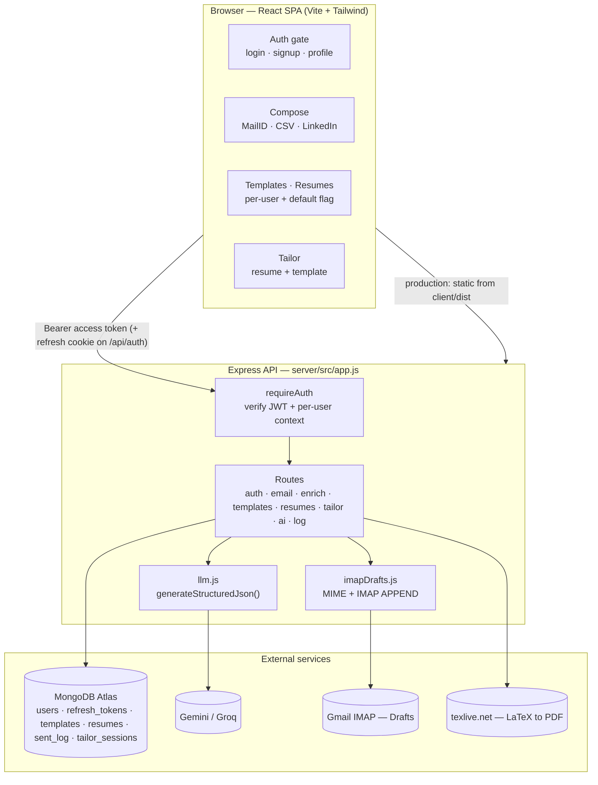
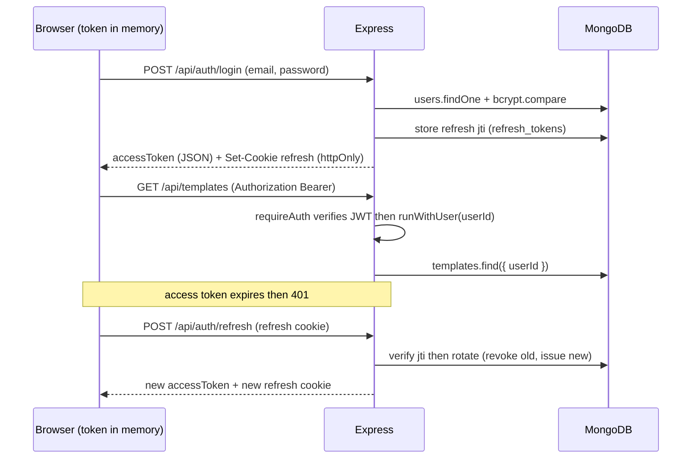
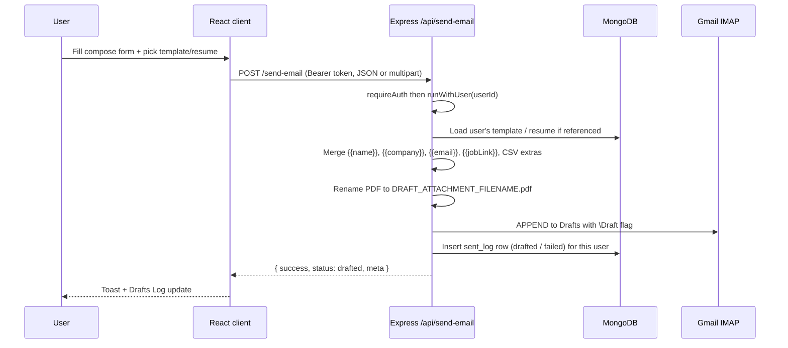
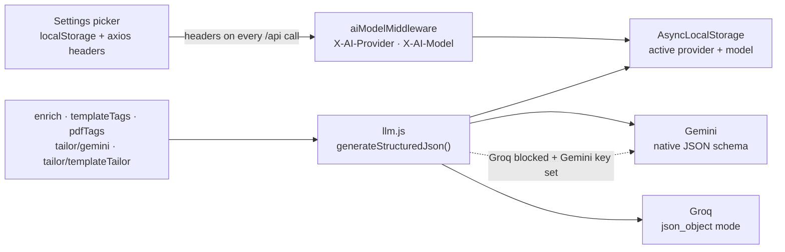
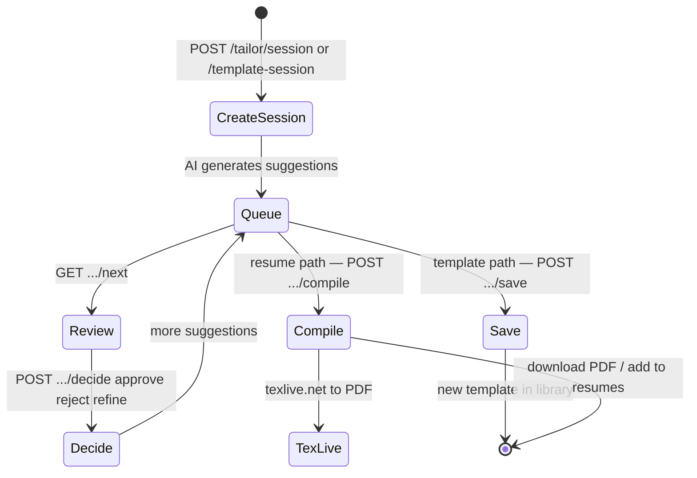

# coldMail — Project Details

Architecture, data flows, auth, AI, and deployment. For setup, see [README.md](./README.md).

## Contents

- [Overview](#overview)
- [High-level architecture](#high-level-architecture)
- [Auth and per-user data](#auth-and-per-user-data)
- [Request flow — saving a draft](#request-flow--saving-a-draft)
- [AI architecture](#ai-architecture)
- [Tailor system](#tailor-system)
- [Module map](#module-map)
- [MongoDB collections](#mongodb-collections)
- [Configuration](#configuration)
- [API reference](#api-reference)
- [Deployment (Render)](#deployment-render)
- [Security](#security)
- [Development](#development)

---

## Overview

**coldMail** is a multi-user cold-email workbench. Each user maintains their own library of HTML templates and PDF resumes, composes personalised outreach in three input modes (MailID / CSV / LinkedIn), optionally lets AI pick or tailor content to a job description, and saves every message as a **Gmail draft** (via IMAP).

React + Express monorepo, **MongoDB Atlas** persistence, JWT auth, and a unified LLM layer over **Gemini** and **Groq**. In production Express serves the built SPA and the API from one origin.

---

## High-level architecture


```mermaid
flowchart TB
  subgraph Client["Browser — React SPA (Vite + Tailwind)"]
    Gate["Auth gate<br/>login · signup · profile"]
    Compose["Compose<br/>MailID · CSV · LinkedIn"]
    Library["Templates · Resumes<br/>per-user + default flag"]
    Tailor["Tailor<br/>resume + template"]
  end

  subgraph Server["Express API — server/src/app.js"]
    AuthMW["requireAuth<br/>verify JWT + per-user context"]
    Routes["Routes<br/>auth · email · enrich · templates · resumes · tailor · ai · log"]
    LLM["llm.js<br/>generateStructuredJson()"]
    Draft["imapDrafts.js<br/>MIME + IMAP APPEND"]
  end

  subgraph External["External services"]
    Mongo[("MongoDB Atlas<br/>users · refresh_tokens · templates · resumes · sent_log · tailor_sessions")]
    AIP[("Gemini / Groq")]
    Gmail[("Gmail IMAP — Drafts")]
    TexLive[("texlive.net — LaTeX to PDF")]
  end

  Client -->|"Bearer access token (+ refresh cookie on /api/auth)"| AuthMW
  AuthMW --> Routes
  Routes --> LLM --> AIP
  Routes --> Mongo
  Routes --> Draft --> Gmail
  Routes --> TexLive
  Client -->|"production: static from client/dist"| Server
```

- **Single-origin in production:** Express serves the SPA at `/` and the API at `/api/*` — one URL, one process, one Render deploy.
- **Development:** Vite (`:5173`) proxies `/api` to Express (`:4000`); CORS allows configured origins plus any localhost port, with `credentials` enabled for the refresh cookie.

---

## Auth and per-user data

Email + password auth using JWT. The **access token** (short-lived) is held in browser memory and sent as `Authorization: Bearer`; the **refresh token** (long-lived) is an httpOnly cookie scoped to `/api/auth`, rotated on every refresh and revocable via the `refresh_tokens` store.


```mermaid
sequenceDiagram
  participant B as Browser (token in memory)
  participant S as Express
  participant M as MongoDB
  B->>S: POST /api/auth/login (email, password)
  S->>M: users.findOne + bcrypt.compare
  S->>M: store refresh jti (refresh_tokens)
  S-->>B: accessToken (JSON) + Set-Cookie refresh (httpOnly)
  B->>S: GET /api/templates (Authorization Bearer)
  S->>S: requireAuth verifies JWT then runWithUser(userId)
  S->>M: templates.find({ userId })
  Note over B,S: access token expires then 401
  B->>S: POST /api/auth/refresh (refresh cookie)
  S->>M: verify jti then rotate (revoke old, issue new)
  S-->>B: new accessToken + new refresh cookie
```

**Per-user scoping:** `requireAuth` runs the request inside an `AsyncLocalStorage` user context (`services/userContext.js`), mirroring the AI-model middleware. Every store (`store.js`, `resumeStore.js`, `tailor/sessionPersistence.js`) reads the current `userId` and filters/stamps queries automatically — so routes and deep tailor call-chains need no changes and users only ever see their own data.

**Defaults:** a user can mark one template and one resume as their default (`isDefault` flag, one per user). Compose auto-selects them; otherwise it starts blank.

**Admin seed:** on boot, if `SEED_ADMIN_EMAIL` + `SEED_ADMIN_PASSWORD` are set, `seed/seedAdmin.js` creates the user (if missing) and assigns any pre-existing unowned documents to it. Idempotent.

---

## Request flow — saving a draft


```mermaid
sequenceDiagram
  participant U as User
  participant SPA as React client
  participant API as Express /api/send-email
  participant DB as MongoDB
  participant IMAP as Gmail IMAP

  U->>SPA: Fill compose form + pick template/resume
  SPA->>API: POST /send-email (Bearer token, JSON or multipart)
  API->>API: requireAuth then runWithUser(userId)
  API->>DB: Load user's template / resume if referenced
  API->>API: Merge {{name}}, {{company}}, {{email}}, {{jobLink}}, CSV extras
  API->>API: Rename PDF to DRAFT_ATTACHMENT_FILENAME.pdf
  API->>IMAP: APPEND to Drafts with \Draft flag
  API->>DB: Insert sent_log row (drafted / failed) for this user
  API-->>SPA: { success, status: drafted, meta }
  SPA-->>U: Toast + Drafts Log update
```

**Why drafts, not direct send?** Render's free tier blocks outbound SMTP (25/465/587). IMAP `APPEND` with the `\Draft` flag is free and lets you review + use Gmail's native Schedule Send. `RESEND_API_KEY` remains an optional direct-send path.

---

## AI architecture

All structured-AI calls go through one server abstraction; provider/model are chosen per request from headers.


```mermaid
flowchart LR
  Picker["Settings picker<br/>localStorage + axios headers"]
  AIM["aiModelMiddleware<br/>X-AI-Provider · X-AI-Model"]
  Ctx["AsyncLocalStorage<br/>active provider + model"]
  LLM["llm.js<br/>generateStructuredJson()"]
  Feat["enrich · templateTags · pdfTags<br/>tailor/gemini · tailor/templateTailor"]
  G["Gemini<br/>native JSON schema"]
  Q["Groq<br/>json_object mode"]

  Picker -->|"headers on every /api call"| AIM --> Ctx
  Feat --> LLM --> Ctx
  LLM --> G
  LLM --> Q
  LLM -.->|"Groq blocked + Gemini key set"| G
```

| Feature | Endpoint | Input to model | Output |
|---------|----------|----------------|--------|
| Email patterns | `POST /enrich/email` | Company + optional domain | 5 ranked `{pattern, confidence}` |
| Name extraction | `POST /enrich/names` | Emails + company | `{candidates:[{email,name}]}` |
| JD match | `POST /enrich/jd-match` | JD + library `{id,name,tags}` only | `{templateId, resumeId}` |
| Job intake | `POST /enrich/job-intake` | Pasted JD or job URL text | `{jd, company, roleTitle}` |
| Template / resume tags | `POST /templates|resumes/suggest-tags` | Subject+body / PDF bytes | `{tags[]}` |
| Resume / template tailor | `POST /tailor/(session|template-session)` | LaTeX sections / paragraphs + JD | Ordered suggestions |

**Privacy:** JD match sends only `{id, name, tags}` — never full bodies or PDF bytes unless a feature needs it (PDF tagging, resume tailoring). **Groq notes:** OpenAI-compatible `json_object` mode; PDF analysis needs Gemini; auto-falls back to Gemini if a Groq model is project-blocked.

---

## Tailor system

Two parallel workflows on the Tailor tab, both session-based and per-user.


```mermaid
stateDiagram-v2
  [*] --> CreateSession: POST /tailor/session or /template-session
  CreateSession --> Queue: AI generates suggestions
  Queue --> Review: GET .../next
  Review --> Decide: POST .../decide approve reject refine
  Decide --> Queue: more suggestions
  Queue --> Compile: resume path — POST .../compile
  Compile --> TexLive: texlive.net to PDF
  Queue --> Save: template path — POST .../save
  Save --> [*]: new template in library
  Compile --> [*]: download PDF / add to resumes
```

- **Resume tailor:** parses a LaTeX CV into sections/bullets/skills; AI suggests content-only rewrites (same macros); approved edits compile to PDF via texlive.net.
- **Template tailor:** parses subject + paragraphs; AI rewrites preserve HTML and `{{tokens}}`; result can be saved as a new template.

---

## Module map

```
coldMail/
├── client/                     # React 18 + Vite + Tailwind 3
│   └── src/
│       ├── App.jsx             # Auth gate + tabs (Compose/Templates/Resumes/Tailor/Log)
│       ├── main.jsx            # AuthProvider + JdProvider + theme
│       ├── context/            # authContext · jdContext · tailorTarget
│       ├── lib/                # api · authToken · aiModel · aiError · tailorApi · render · utils
│       └── components/
│           ├── EmailForm.jsx   # Three compose modes; applies default template/resume
│           ├── TemplateLibrary.jsx · ResumeLibrary.jsx   # CRUD + tags + "set as default"
│           ├── auth/AuthPage.jsx · profile/ProfilePanel.jsx
│           ├── Tailor/         # Resume + template tailoring UI
│           └── ...             # panels, pickers, modals, header
├── server/                     # Express 4 (ESM)
│   └── src/
│       ├── app.js              # helmet · cors(credentials) · cookie-parser · public vs requireAuth routes
│       ├── index.js            # Boot, Mongo connect, seedAdmin, graceful shutdown
│       ├── routes/             # auth · email · templates · resumes · enrich · tailor · ai · log
│       ├── seed/seedAdmin.js   # Idempotent admin seed + claim of unowned docs
│       ├── middleware/         # auth · aiModel · validate · rateLimit · upload · error
│       └── services/
│           ├── db.js           # Mongo client + indexes (incl. users, refresh_tokens, userId)
│           ├── userContext.js  # AsyncLocalStorage per-user scoping
│           ├── userStore.js · jwt.js · refreshTokenStore.js   # Auth
│           ├── store.js · resumeStore.js   # Per-user CRUD (+ isDefault)
│           ├── imapDrafts.js · mailer.js · enrich.js
│           ├── llm.js · aiModel.js · aiErrors.js · templateTags.js · pdfTags.js
│           └── tailor/         # LaTeX parse/compile, sessions, AI suggestions
├── scripts/                    # CLI apply pipeline (optional automation)
├── render.yaml · package.json
```

---

## MongoDB collections

| Collection | Contents |
|------------|----------|
| `users` | `{ id, email (unique), name, passwordHash, createdAt }` |
| `refresh_tokens` | `{ jti (unique), userId, revoked, expiresAt (TTL) }` — rotation + revocation |
| `templates` | `{ id, userId, name, subject, body, tags[], isDefault?, createdAt, updatedAt }` |
| `resumes` | `{ id, userId, name, tags[], filename, contentType, content (Binary), size, isDefault? }` |
| `sent_log` | `{ id, userId, to, subject, status, sentAt, error? }` |
| `tailor_sessions` | `{ id, userId, kind, queue/applied state, expiresAt (TTL) }` |

Indexes (incl. `email` unique, `userId` compound, and TTLs) are ensured on boot in `services/db.js`.

---

## Configuration

Full template: [`server/.env.example`](./server/.env.example).

```env
# Server
PORT=4000
NODE_ENV=development
CORS_ORIGIN=http://localhost:5173

# MongoDB Atlas (required)
MONGODB_URI=mongodb+srv://...
MONGODB_DB=coldmail

# Auth (JWT) — generate strong random secrets in production
JWT_ACCESS_SECRET=
JWT_REFRESH_SECRET=
JWT_ACCESS_TTL=15m
JWT_REFRESH_TTL=30d
AUTH_RATE_LIMIT_MAX=20

# Admin seed (optional) — creates user + claims unowned data on first boot
SEED_ADMIN_EMAIL=
SEED_ADMIN_NAME=
SEED_ADMIN_PASSWORD=

# Gmail — IMAP for drafts; SMTP for local dev fallback
SMTP_USER=you@gmail.com
SMTP_PASS=xxxx xxxx xxxx xxxx
IMAP_HOST=imap.gmail.com
IMAP_PORT=993
MAIL_FROM="Your Name <you@gmail.com>"
DRAFT_ATTACHMENT_FILENAME=Sk_Sahil_Parvez_CV

# AI — at least one key enables AI features
GEMINI_API_KEY=
GROQ_API_KEY=
AI_PROVIDER=gemini

# Rate limits + Tailor
RATE_LIMIT_WINDOW_MIN=1
RATE_LIMIT_MAX=30
CV_DEFAULT_PATH=./Sk_Sahil_Parvez_CV_
TEXLIVE_NET_URL=https://texlive.net/cgi-bin/latexcgi
```

**Gmail:** enable 2-Step Verification, create an app password, use it for `SMTP_PASS` (same credential for IMAP). **AI keys:** [Gemini](https://aistudio.google.com/app/apikey) (`gemini-2.5-flash`) / [Groq](https://console.groq.com/keys) (`llama-3.3-70b-versatile`); pick provider + model in Settings.

---

## API reference

All endpoints under `/api`. **Public:** `/health`, `/ai/*`, `/auth/(signup|login|refresh|logout)`. **Everything else requires a Bearer access token.** Rate-limited: auth, send, enrich, tailor.

| Method | Path | Description |
|--------|------|-------------|
| POST | `/auth/signup` · `/auth/login` | Create / authenticate; returns access token + sets refresh cookie |
| POST | `/auth/refresh` · `/auth/logout` | Rotate access token / revoke session |
| GET · PATCH · POST | `/auth/me` · `/auth/profile` · `/auth/change-password` | Current user, update name, change password |
| GET | `/health` · `/ai/models` · `/ai/providers` | Liveness, model + provider listing |
| POST | `/preview` · `/send-email` · `/send-bulk` | Render / save one or many drafts |
| POST | `/enrich/(email\|names\|jd-match\|job-intake)` | AI enrichment |
| GET/POST/PUT/DELETE | `/templates` · `/resumes` | Per-user CRUD (+ `PUT/DELETE /:id/default`, `/suggest-tags`) |
| GET/DELETE | `/log` | Drafts log |
| * | `/tailor/*` | Resume + template tailor sessions |

Example — `POST /send-email` (with `Authorization: Bearer <token>`):

```json
{ "email": "john@example.com", "name": "John", "company": "Acme",
  "subject": "Quick question for {{company}}",
  "template": "<h1>Hello {{name}}</h1>", "resumeId": "iops5MJTAc" }
```

---

## Deployment (Render)

[`render.yaml`](./render.yaml) defines a single web service:

1. Push to GitHub → Render **Blueprint** → select repo.
2. Set secrets: `MONGODB_URI`, `JWT_ACCESS_SECRET`, `JWT_REFRESH_SECRET`, `SEED_ADMIN_PASSWORD`, `SMTP_USER`, `SMTP_PASS`, `MAIL_FROM`, `GEMINI_API_KEY`, `GROQ_API_KEY`/`RESEND_API_KEY` (optional).
3. Atlas → Network Access → allow `0.0.0.0/0` (Render free tier has unstable outbound IPs).
4. Verify: `GET /api/health` → `{ "ok": true, "features": { "aiEnrich": true } }`.

Verify the production build locally:

```bash
npm run build
NODE_ENV=production node server/src/index.js   # SPA + API on :4000
```

**Free-tier caveats:** service sleeps after ~15 min idle (30–60s cold start); Atlas M0 may sleep; outbound SMTP blocked so IMAP drafts is the default.

---

## Security

- **Auth** — bcrypt password hashing; JWT access token in memory + httpOnly refresh cookie with rotation, reuse-detection, and server-side revocation (`refresh_tokens`).
- **Per-user isolation** — `requireAuth` + `AsyncLocalStorage` scope every store query to the owner; id-based reads/writes verify ownership.
- **helmet** — security headers (CSP disabled so Vite bundles + sandboxed previews work). **CORS** — allowlist via `CORS_ORIGIN`, `credentials` enabled for the refresh cookie.
- **Rate limiting** — stricter limiter on auth routes; standard limiter on send + AI routes.
- **Validation** — `validator` on auth + send endpoints. **Secrets** — only in `server/.env` / Render env, never sent to the client. **Preview sandbox** — template preview iframe uses `sandbox`.
- **AI data minimisation** — JD match sends `{id, name, tags}` only.

---

## Development

```bash
git clone <repo> coldMail && cd coldMail
npm run install:all
cp server/.env.example server/.env   # MONGODB_URI, JWT secrets, mail creds, AI keys
npm run dev                          # API :4000 + Vite :5173 (proxies /api)
```

| Script | Action |
|--------|--------|
| `npm run install:all` | Install root + client + server deps |
| `npm run dev` | Concurrent Vite client + `--watch` server |
| `npm run build` | Build client → `client/dist` |
| `npm start` | Production: serve SPA + API |

Health check: `GET /api/health` returns `ok: true` and `features.aiEnrich: true` when an AI key is set.
